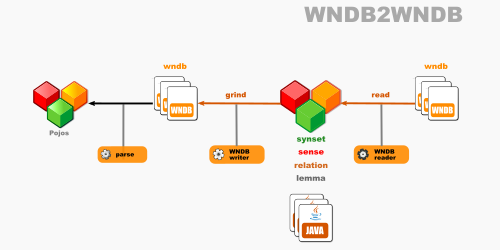

# Open English Wordnet WNDB-to-WNDB grinder

This library reads a model from WNDB files and writes it to WNDB format.

Project [grind_wndb2wndb](https://github.com/x-englishwordnet/grind_wndb2wndb)

See also [model](https://github.com/x-englishwordnet/model/blob/master/README.md).

See also [fromwndb](https://github.com/x-englishwordnet/fromwndb/blob/master/README.md).

See also [towndb](https://github.com/x-englishwordnet/towndb/blob/master/README.md).

See also [x-englishwordnet](https://github.com/x-englishwordnet) and [globalwordnet/english-wordnet](https://github.com/globalwordnet/english-wordnet).

## Dataflow

This library reads from WNDB files and other WNDB files that contain extra data.

This output conforms to the **WNDB** standards.

## Command line

`grind.sh [WNDB] [WNDB2] [WNDB3]`

grinds the WNDB database

*where*

[WNDB] directory where OEWN distribution WNDB files are

[WNDB2] directory where extra WNDB files are

[WNDB3] directory where WNDB files are output

## Maven Central

		<groupId>io.github.x-englishwordnet</groupId>
		<artifactId>wndb2wndb</artifactId>
		<version>1.0.0-SNAPSHOT</version>

## Dependencies

